<p align="center">
  
</p>

# RAG from Scratch

A small learning lab for understanding a retrieval-augmented generation pipeline by building the important steps directly instead of hiding them behind an orchestration framework.

## What the current experiment does

```text
PDF
 ↓
extract text
 ↓
sentence-sized chunking
 ↓
MiniLM embeddings
 ↓
ChromaDB
 ↓
similarity retrieval
 ↓
retrieved context
 ↓
Gemini answer
```

The current script uses `pdfplumber` to read `pdf.pdf`, `sentence-transformers/all-MiniLM-L6-v2` for local embeddings, a persistent ChromaDB collection for vector storage, and Gemini 2.5 Flash for generation.

## Why this repository exists

This is intentionally a **learning repository**, not a finished RAG framework. The point is to inspect each layer and understand questions such as:

- How should documents be chunked?
- What exactly is stored in a vector database?
- How does similarity retrieval choose context?
- What happens when the relevant chunk is not retrieved?
- How much does retrieval quality affect the final answer?
- Where should grounding and refusal behavior live?

The lessons here feed into the larger [Knowledge AI](https://github.com/SanamRai001/knowledge-ai) project.

## Current implementation

`rag.py` currently:

1. loads environment variables,
2. extracts text from a local PDF,
3. chunks text to roughly 300 characters,
4. creates MiniLM embeddings,
5. stores them in a persistent ChromaDB collection,
6. embeds a query,
7. retrieves the two closest chunks,
8. injects those chunks into a grounded prompt,
9. sends the prompt to Gemini.

The query and input PDF are currently hard-coded because this repository is being used to study the pipeline one piece at a time.

## Run locally

Install the Python dependencies used in `rag.py`, create a `.env` containing your Gemini API key, place a PDF at `pdf.pdf`, and run:

```bash
python rag.py
```

Expected environment variable:

```env
GEMINI_API_KEY=your_key_here
```

---

**Sanam Rai** · [Profile](https://github.com/SanamRai001) · [Knowledge AI](https://github.com/SanamRai001/knowledge-ai)
